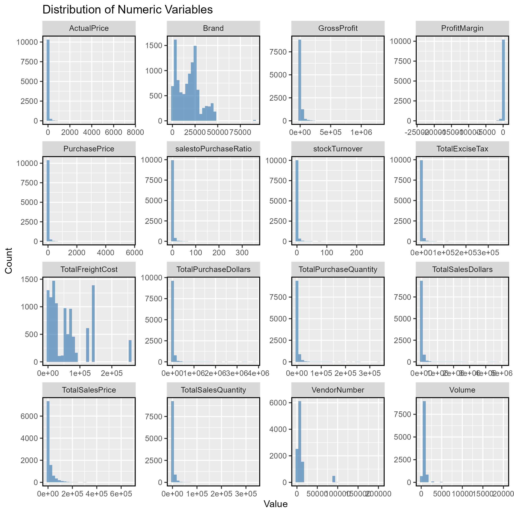
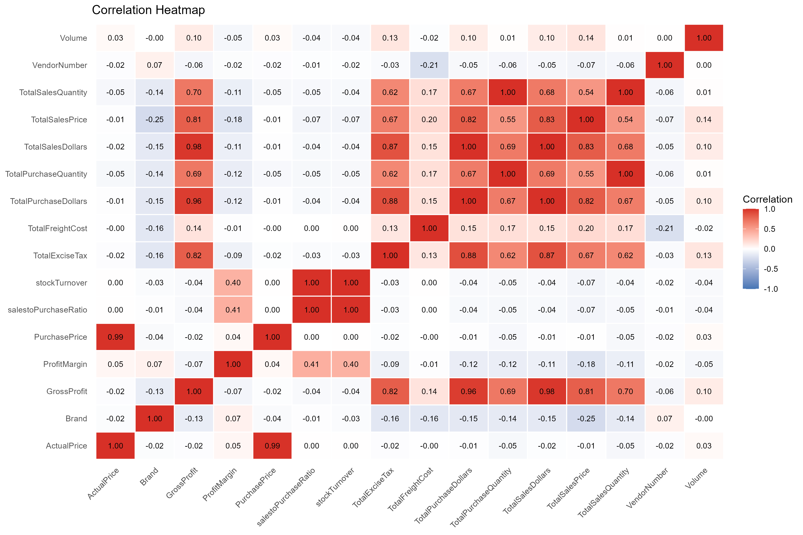
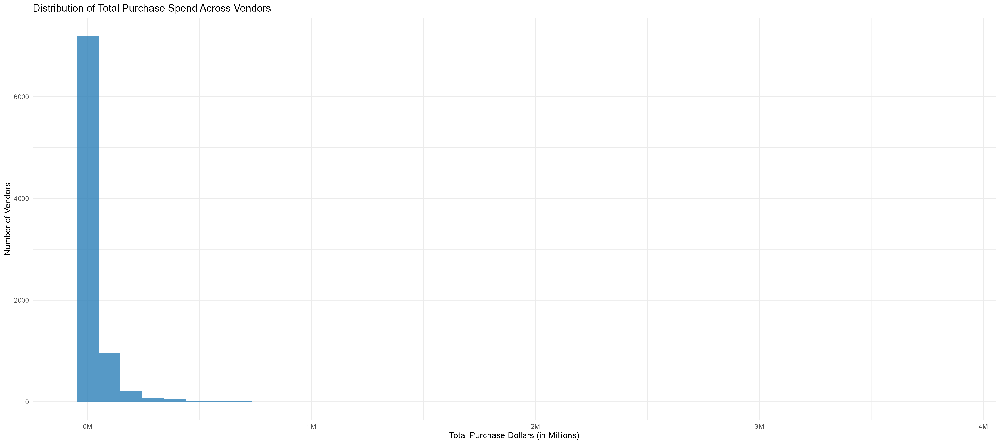
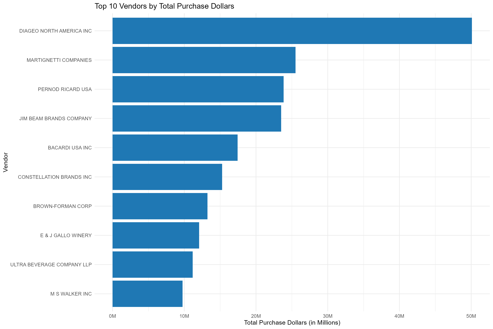
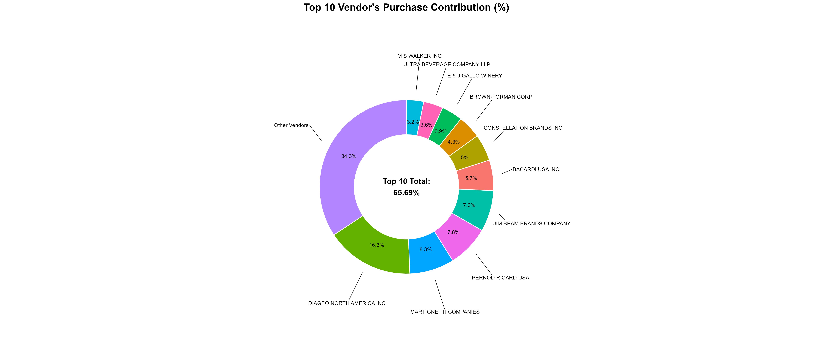
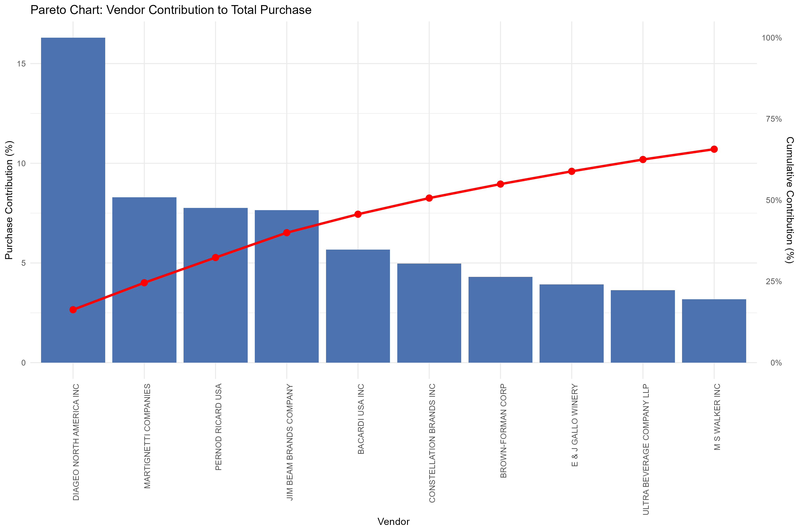
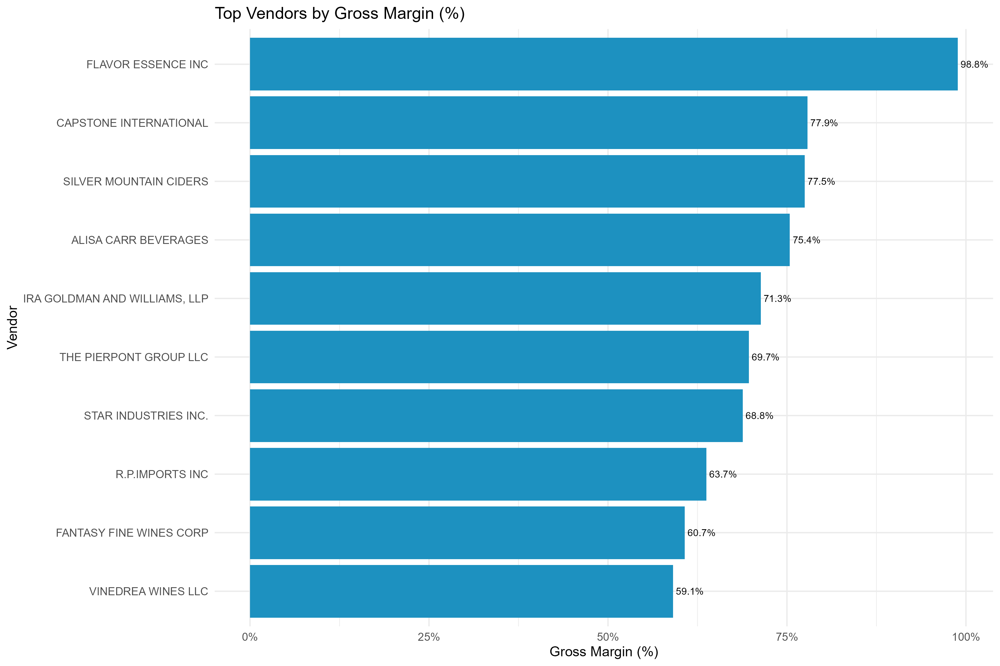

## Table of Contents
- <a href="#overview">Overview</a>
- <a href="#business-problem">Business Problem</a>
- <a href="#objective">Objective</a>
- <a href="#dataset">Dataset</a>
- <a href="#tools--technologies">Tools & Technologies</a>
- <a href="#project-structure">Project Structure</a>
- <a href="#data-cleaning--preparation">Data Cleaning & Preparation</a>
- <a href="#exploratory-data-analysis-eda">Exploratory Data Analysis (EDA)</a>
- <a href="#business-questions">Business Questions</a>
- <a href="#key-insights">Key Insights</a>
- <a href="#how-to-run">How to Run This Project</a>
- <a href="#conclusion">Conclusion & Recommendations</a>
- <a href="#author--contact">Author & Contact</a> 



 

---
<h2><a class="anchor" id="overview"></a>Project Overview</h2>
This project analyzes vendor purchasing and sales performance using transactional inventory data. The objective is to identify high-value vendors, evaluate procurement concentration, measure profitability, and generate business recommendations for improving purchasing strategy.

---
<h2><a class="anchor" id="business-problem"></a>Business Problem</h2>
Organizations often purchase inventory from hundreds of vendors.

Understanding which vendors contribute the largest share of purchasing and profitability helps reduce procurement risk, negotiate better contracts, and improve supply chain efficiency.

This analysis identifies purchasing concentration, vendor profitability, and inventory performance using historical transactional data.

---
<h2><a class="anchor" id="objective"></a>Objectives</h2>

- Evaluate vendor purchasing performance
- Measure procurement concentration
- Identify top vendors
- Analyze profitability
- Detect inventory inefficiencies
- Support purchasing decisions using data

---
<h2><a class="anchor" id="dataset"></a>Dataset</h2>

- Multiple CSV files located in '/data/' folder (sales, vendors, inventory)
- Summary table created from ingested data and used for analysis
- Vendor-level aggregated inventory dataset.

    Rows: 10,692

    Columns: 18


---
<h2><a class="anchor" id="data-pipeline"></a> Data Pipeline</h2>

The analysis integrates six source datasets covering inventory, purchases,
sales, pricing, and vendor invoice information.

The datasets were cleaned and standardized before being joined at the
vendor/brand level to create a consolidated `vendor_sales_summary` dataset.

This analytical dataset combines:

- Purchase quantities and purchase costs
- Sales quantities and sales revenue
- Product pricing
- Freight and invoice costs
- Vendor and brand information
- Derived profitability and performance metrics

The consolidated dataset was then used for exploratory data analysis,
vendor performance evaluation, and business recommendations.

### Pipeline

Raw CSV Files
→ Data Cleaning
→ Data Validation
→ Dataset Integration
→ Vendor-Level Aggregation
→ Derived Metrics
→ EDA
→ Business Insights


---
<h2><a class="anchor" id="tools--technologies"></a> Tools & Technologies</h2>

- R
- RStudio
- tidyverse
- ggplot2
- janitor
- skimr
- scales
- ggrepel
- R Markdown


---
<h2><a class="anchor" id="data-cleaning--preparation"></a>Data Cleaning & Preparation</h2>
- Removed transactions with:
  - Gross Profit ≤ 0
  - Profit Margin ≤ 0
  - Sales Quantity = 0
- Created summary tables with vendor-level metrics
- Converted data types, handled outliers, merged lookup tables


---
<h2><a class="anchor" id="exploratory-data-analysis-eda"></a>Exploratory Data Analysis (EDA)</h2>

**Negative or Zero Values Detected:**
- Gross Profit: Min -52,002.78 (loss-making sales)
- Profit Margin: Min -∞ (sales at zero or below cost)
- Unsold Inventory: Indicating slow-moving stock

**Outliers Identified:**
- High Freight Costs (up to 257K)
- Large Purchase/Actual Prices

**Correlation Analysis:**
- Weak between Purchase Price & Profit
- Strong between Purchase Qty & Sales Qty (0.999)
- Negative between Profit Margin & Sales Price (-0.179)


---
<h2><a class="anchor" id="business-questions"></a> Business Questions</h2>
- Which vendors contribute most to purchasing?
- How concentrated is vendor spending?
- Which vendors generate the highest profit?
- Which vendors have poor sales-to-purchase ratios?
- Are purchasing activities diversified?

---
<h2><a class="anchor" id="key-insights"></a> Key Insights</h2>


- The top 10 vendors contribut 65.69% of total purchasing purchase, while the remaining vendors contribut 34.31%.

- Vendor purchasing follows a highly right-skewed distribution, where a small number of vendors dominate total expenditure.

- Several vendors exhibit high purchasing volumes but relatively low gross profit, suggesting opportunities to renegotiate supplier agreements.

- 198 brands exhibit lower sales but higher profit margins.


---
<h2><a class="anchor" id="project-structure"></a>Project Structure</h2>

Vendor_Performance_Analysis/
│
├── data/
│   ├── raw/
│   └── processed/
│
├── scripts/
│   ├── 01_load_data.R
│   ├── 02_data_cleaning.R
│   ├── 03_build_vendor_sales_summary_table.R
│   ├── 04_eda.R
│   └── utils.R
│
├── output/
│   ├── tables/
│   └── plots/
│
├── reports/
│   ├── report.Rmd
│   └── report.html
│
├── docs/
│   ├── business_problem.md
│   ├── data_cleaning_note.md
│   ├── vendor_sales_summary_design.md
│   └── vendor_sales_analysis.md
│
├── config/
│   └── paths.R
│
├── run_project.R
├── Vender_Performance_Analysis_R_Tableau.Rproj
└── README.md


## Purchase Distribution



## Top 10 Vendors by Purchase Dollars




## Purchase Contribution Analysis



## Pareto (80/20) Analysis



## Gross Margin Analysis




---
<h2><a class="anchor" id="author--contact"></a>Full Report</h2>

For the complete analysis, methodology, data cleaning process, statistical analysis, and visualizations, see the [R Markdown Report](reports/report.Rmd).

---
<h2><a class="anchor" id="how-to-run"></a>How to Run this Project</h2>

### 1. Clone the Repository

1. Clone the repository:

Clone the repository to your local machine and open
`Vendor_Performance_Analysis.Rproj` in RStudio.

### 2. Run the Project

Open `run_project.R` in RStudio and run the script.

The project automatically checks and installs the required R packages
before executing the analysis pipeline.

The pipeline runs in the following order:

```text
01_load_data.R
      ↓
02_data_cleaning.R
      ↓
03_build_vendor_sales_summary_table.R
      ↓
04_eda.R
```

---

<h2><a class="anchor" id="conclusion"></a>Conclusion & Recommendations</h2>
The analysis identified high purchasing concentration among a small group of vendors, highlighting potential supplier dependency and procurement risk.

Key recommendations include:

- Monitor dependency on top vendors and diversify supplier partnerships.
- Evaluate profitability and pricing opportunities across vendors and brands.
- Optimize purchasing and slow-moving inventory to improve operational efficiency.
- Strengthen marketing and distribution strategies for low-performing vendors.

These actions can support sustainable profitability while reducing supply-chain risk.

---
<h2><a class="anchor" id="author--contact"></a>Author & Contact</h2>

**Fatima Zehra**  
Data Analyst  
📧 Email:  
🔗 [LinkedIn]

